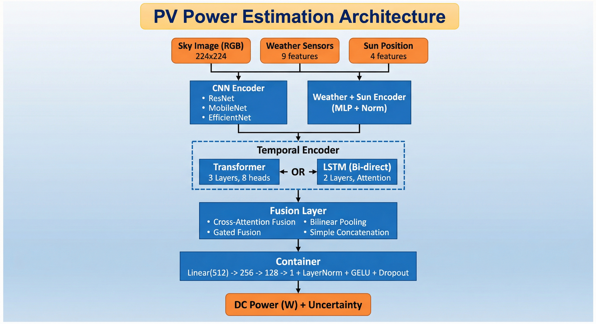

# PV Power Estimation - Sky Image & Weather-Based DC Power Prediction

<p align="center">
  
  
  
  
</p>

<p align="center">
  <b>A Multi-Modal Deep Learning System for Predicting Solar PV DC Power Output</b>
</p>

---

## Try It Online & Run Locally

### Run on Your Local Computer (Easiest Method)

**Step 1: Download the project**
```bash
git clone https://github.com/Pradsey5010/PV-Power-Estimation.git
cd PV-Power-Estimation/sky_power_estimation
```

**Step 2: Install dependencies**
```bash
pip install streamlit plotly torch torchvision numpy pandas pillow scikit-learn pyyaml tqdm
```

**Step 3: Run the dashboard**
```bash
streamlit run dashboard/app.py
```

**Step 4: Open in browser**
- The terminal will show: `Local URL: http://localhost:8501`
- Open this URL in your browser: **http://localhost:8501**
- If port 8501 is busy, try: `streamlit run dashboard/app.py --server.port 8502`

> **Troubleshooting:**
> - If you see "command not found", run: `python -m streamlit run dashboard/app.py`
> - On Windows, use Command Prompt or PowerShell (not Git Bash)
> - Make sure Python 3.8+ is installed: `python --version`

---

### ☁️ Run in Google Colab (No Local Setup)

[](https://colab.research.google.com/github/Pradsey5010/PV-Power-Estimation/blob/main/notebooks/demo.ipynb)

The Colab notebook lets you:
- ✅ Explore the model architecture
- ✅ Generate synthetic sky images
- ✅ Extract cloud features
- ✅ Calculate sun position
- ✅ Run power predictions

> **Note:** The interactive Streamlit dashboard works best on local computers. Colab is great for exploring the code and running predictions.

---

### Other Online Options

| Platform | Link | Best For |
|----------|------|----------|
| **GitHub Codespaces** | [](https://codespaces.new/Pradsey5010/PV-Power-Estimation) | Full dev environment |
| **Gitpod** | [](https://gitpod.io/#https://github.com/Pradsey5010/PV-Power-Estimation) | Quick browser IDE |
| **View Code** | [GitHub Repository](https://github.com/Pradsey5010/PV-Power-Estimation) | Browse source code |

---

### Quick Commands Reference

```bash
# Clone and run (copy-paste this entire block)
git clone https://github.com/Pradsey5010/PV-Power-Estimation.git
cd PV-Power-Estimation/sky_power_estimation
pip install streamlit plotly torch torchvision numpy pandas pillow scikit-learn
streamlit run dashboard/app.py

# The dashboard will open automatically at http://localhost:8501
```

---

## Table of Contents

- [Try It Online](#-try-it-online-no-installation-required)
- [Overview](#overview)
- [How It Works](#how-it-works)
- [Architecture](#architecture)
- [Features](#features)
- [Tech Stack](#tech-stack)
- [Project Structure](#-project-structure)
- [Branch Overview](#branch-overview)
- [Installation](#installation)
- [Quick Start](#quick-start)
- [Usage Examples](#usage-examples)
- [API Reference](#api-reference)
- [Configuration](#configuration)
- [Datasets](#datasets)
- [Scope & Applications](#scope--applications)
- [Contributing](#contributing)
- [License](#license)

---

## Overview

**PV Power Estimation** is an advanced deep learning system that predicts DC power output from solar photovoltaic (PV) installations by combining multiple data sources:

| Data Source | Purpose |
|-------------|---------|
| **Sky Images** | Analyze cloud cover, opacity, and atmospheric conditions |
| **Weather Sensors** | Incorporate temperature, humidity, pressure, wind, and irradiance |
| **Sun Position** | Calculate precise solar geometry using astronomical algorithms |
| **Temporal Patterns** | Capture time-dependent variations in power generation |

This multi-modal approach significantly outperforms single-source prediction methods by leveraging complementary information from different modalities.

---

## How It Works

### 1 Data Acquisition
```
┌─────────────────┐   ┌─────────────────┐   ┌─────────────────┐
│   Sky Camera    │   │ Weather Station │   │   Timestamp     │
│   (Fisheye)     │   │    (Sensors)    │   │   (System)      │
└────────┬────────┘   └────────┬────────┘   └────────┬────────┘
         │                     │                     │
         ▼                     ▼                     ▼
```

### 2️ Feature Extraction
- **Sky Images**: Processed through CNN (ResNet/MobileNet/EfficientNet) to extract visual features like cloud patterns, opacity, and sky conditions
- **Weather Data**: Normalized and encoded through MLP layers
- **Sun Position**: Calculated using pvlib library for precise zenith, azimuth, and elevation angles

### 3️ Temporal Modeling
- Historical sequences (configurable, default 12 timesteps) are processed through LSTM or Transformer encoders
- Captures temporal patterns, trends, and cyclical variations

### 4️ Multi-Modal Fusion
- Features from all modalities are combined using attention-based fusion
- The model learns to weight different modalities based on context

### 5️ Power Prediction
- Fused features pass through regression head
- Outputs DC power in Watts with optional uncertainty estimation

---

## Architecture

<p align="center">
  
</p>

The architecture shows the complete data flow:

1. **Input Layer**: Sky Image (RGB 224×224), Weather Sensors (9 features), Sun Position (4 features)
2. **Encoding**: CNN Encoder (ResNet/MobileNet/EfficientNet) + Weather & Sun Encoder (MLP + Norm)
3. **Temporal Processing**: Transformer (3 layers, 8 heads) OR LSTM (Bi-directional, 2 layers)
4. **Fusion**: Cross-Attention, Gated Fusion, Bilinear Pooling, or Simple Concatenation
5. **Output**: Container layer (Linear 512→256→128→1 + LayerNorm + GELU + Dropout) → DC Power (W) + Uncertainty

### Model Components

| Component | Options | Description |
|-----------|---------|-------------|
| **Image Encoder** | ResNet18/34/50/101, MobileNetV3-S/L, EfficientNet-B0/B1/B2, ConvNeXt | Pretrained CNN backbones for visual feature extraction |
| **Temporal Encoder** | Transformer (3L, 8H), LSTM (Bidirectional), GRU | Sequence modeling for temporal patterns |
| **Fusion Layer** | Attention, Gated, Bilinear, Concat | Multi-modal feature combination |
| **Output Head** | MLP with LayerNorm, GELU, Dropout | Regression for power prediction |

---

## Features

### Core Features
- ✅ **Multi-Modal Learning**: Combines images, weather, and sun position
- ✅ **Flexible Backbones**: Support for 10+ CNN architectures
- ✅ **Temporal Modeling**: LSTM/Transformer for sequence patterns
- ✅ **Attention Fusion**: Dynamic modality weighting
- ✅ **Uncertainty Estimation**: Monte Carlo dropout for confidence intervals

### Training Features
- ✅ **Mixed Precision**: Automatic Mixed Precision (AMP) for faster training
- ✅ **Learning Rate Scheduling**: Cosine, Step, Plateau, OneCycle
- ✅ **Early Stopping**: Prevent overfitting
- ✅ **Gradient Clipping**: Training stability
- ✅ **TensorBoard/WandB**: Experiment tracking

### Inference Features
- ✅ **Real-Time Prediction**: Efficient inference pipeline
- ✅ **Batch Processing**: Process multiple images
- ✅ **Sequence Buffering**: Automatic history management
- ✅ **Cloud Feature Extraction**: OpenCV-based analysis

### Data Processing
- ✅ **Sun Position Calculation**: pvlib integration
- ✅ **Weather Normalization**: StandardScaler/MinMax
- ✅ **Image Augmentation**: Albumentations pipeline
- ✅ **Cloud Segmentation**: Automatic cloud detection

---

## Tech Stack

### Deep Learning Frameworks
| Library | Version | Purpose |
|---------|---------|---------|
| **PyTorch** | 2.0+ | Core deep learning framework |
| **TorchVision** | 0.15+ | Pretrained models & transforms |
| **timm** | 0.9+ | Additional model architectures |

### Computer Vision
| Library | Version | Purpose |
|---------|---------|---------|
| **OpenCV** | 4.8+ | Image processing & cloud detection |
| **Pillow** | 10.0+ | Image I/O |
| **Albumentations** | 1.3+ | Data augmentation |

### Solar & Scientific
| Library | Version | Purpose |
|---------|---------|---------|
| **pvlib** | 0.10+ | Solar position & irradiance |
| **NumPy** | 1.24+ | Numerical computing |
| **Pandas** | 2.0+ | Data manipulation |
| **SciPy** | 1.10+ | Scientific computing |
| **scikit-learn** | 1.3+ | Preprocessing & metrics |

### Visualization & Logging
| Library | Version | Purpose |
|---------|---------|---------|
| **Matplotlib** | 3.7+ | Plotting & visualization |
| **TensorBoard** | 2.14+ | Training visualization |
| **WandB** | 0.15+ | Experiment tracking |
| **tqdm** | 4.65+ | Progress bars |

---

## Project Structure

```
PV-Power-Estimation/
│
├── 📄 README.md                    # This file
├── 📄 LICENSE                      # MIT License
│
└── 🌟 sky_power_estimation/        # Main package (in feature branches)
    │
    ├── 📂 configs/
    │   └── config.yaml             # Model & training configuration
    │
    ├── 📂 scripts/
    │   ├── train.py                # Training script
    │   ├── predict.py              # Inference script
    │   └── evaluate.py             # Evaluation script
    │
    ├── 📂 sky_power_estimation/    # Core Python package
    │   │
    │   ├── 📂 models/
    │   │   ├── image_encoder.py    # CNN encoders (ResNet, MobileNet, etc.)
    │   │   ├── temporal_encoder.py # LSTM/Transformer encoders
    │   │   ├── fusion.py           # Multi-modal fusion layers
    │   │   └── sky_power_model.py  # Complete model
    │   │
    │   ├── 📂 data/
    │   │   ├── dataset.py          # PyTorch Dataset classes
    │   │   ├── dataloader.py       # DataLoader utilities
    │   │   └── transforms.py       # Image augmentation
    │   │
    │   ├── 📂 training/
    │   │   ├── trainer.py          # Training loop
    │   │   └── losses.py           # Loss functions
    │   │
    │   ├── 📂 inference/
    │   │   └── predictor.py        # Inference utilities
    │   │
    │   └── 📂 utils/
    │       ├── sun_position.py     # pvlib wrapper
    │       ├── weather_processor.py# Weather preprocessing
    │       ├── image_processor.py  # Cloud detection (OpenCV)
    │       ├── metrics.py          # Evaluation metrics
    │       ├── config.py           # Configuration utilities
    │       └── logger.py           # Logging utilities
    │
    ├── 📂 tests/
    │   ├── test_model.py           # Model tests
    │   └── test_data.py            # Data tests
    │
    ├── 📄 requirements.txt         # Dependencies
    ├── 📄 setup.py                 # Package installation
    └── 📄 pyproject.toml           # Modern Python config
```

---

## Branch Overview

| Branch | Description | Status |
|--------|-------------|--------|
| **`main`** | Project documentation and overview | 📚 Docs |
| **`feature/complete-multimodal-pipeline`** | Full implementation with all features | ✅ Complete |
| **`feature/src-modular-architecture`** | Alternative modular `src/` structure | 🔧 Alternative |
| **`feature/core-minimal-implementation`** | Minimal core implementation | 🎯 Lightweight |

### Branch Details

#### `feature/complete-multimodal-pipeline`
The main implementation branch with:
- Complete multi-modal model architecture
- All CNN backbones (ResNet, MobileNet, EfficientNet)
- LSTM & Transformer temporal encoders
- Attention-based fusion
- Full training pipeline with AMP
- Comprehensive testing suite

#### 🔧 `feature/src-modular-architecture`
Alternative implementation with:
- Modular `src/` directory structure
- Separate model files (sky_cnn, weather_lstm, fusion_model)
- Simplified training script
- Test data included

#### `feature/core-minimal-implementation`
Lightweight implementation with:
- Core feature extraction
- Basic data loading
- Minimal dependencies
- Quick prototyping setup

---

## Installation

### Prerequisites
- Python 3.8 or higher
- CUDA 11.8+ (for GPU support, optional)
- Git

### Step 1: Clone the Repository

```bash
git clone https://github.com/Pradsey5010/PV-Power-Estimation.git
cd PV-Power-Estimation
```

### Step 2: Choose a Branch

```bash
# For complete implementation (recommended)
git checkout feature/complete-multimodal-pipeline

# For alternative modular structure
git checkout feature/src-modular-architecture

# For minimal implementation
git checkout feature/core-minimal-implementation
```

### Step 3: Install Dependencies

```bash
cd sky_power_estimation
pip install -r requirements.txt
```

### Step 4: Install Package (Optional)

```bash
pip install -e .
```

---

## Quick Start

### Training with Synthetic Data (Testing)

```bash
python scripts/train.py --use-synthetic --epochs 10 --batch-size 16
```

### Training with Real Data

```bash
python scripts/train.py \
    --data-dir /path/to/your/data \
    --epochs 100 \
    --batch-size 32 \
    --backbone resnet50 \
    --temporal-encoder transformer
```

### Inference on Images

```bash
python scripts/predict.py \
    --model checkpoints/best_model.pt \
    --temperature 25 \
    --humidity 60 \
    /path/to/sky_images/
```

### Evaluation

```bash
python scripts/evaluate.py \
    --model checkpoints/best_model.pt \
    --data-dir /path/to/test_data \
    --output predictions.csv
```

---

## Usage Examples

### Python API - Training

```python
from sky_power_estimation.models import SkyPowerModel
from sky_power_estimation.data import create_dataloaders
from sky_power_estimation.training import Trainer

# Create model
model = SkyPowerModel(
    image_backbone="resnet50",
    temporal_type="transformer",
    fusion_method="attention"
)

# Create dataloaders
dataloaders = create_dataloaders(
    data_dir="./data",
    batch_size=32,
    sequence_length=12
)

# Configure training
config = {
    "training": {
        "epochs": 100,
        "learning_rate": 0.001,
        "mixed_precision": True
    },
    "loss": {"type": "mse"}
}

# Train
trainer = Trainer(
    model=model,
    train_loader=dataloaders["train"],
    val_loader=dataloaders["val"],
    config=config
)

results = trainer.train()
print(f"Best validation loss: {results['best_val_loss']:.4f}")
```

### Python API - Inference

```python
from sky_power_estimation.inference import Predictor
from datetime import datetime

# Load predictor
predictor = Predictor(
    model_path="checkpoints/best_model.pt",
    location={
        "latitude": 37.7749,
        "longitude": -122.4194,
        "timezone": "US/Pacific"
    }
)

# Single prediction
power = predictor.predict(
    image="sky_image.jpg",
    weather={
        "temperature": 25,
        "humidity": 60,
        "ghi": 800,
        "dni": 600,
        "dhi": 200
    },
    timestamp=datetime.now()
)
print(f"Predicted power: {power:.1f} W")

# Prediction with uncertainty
mean, std = predictor.predict_with_uncertainty(
    image="sky_image.jpg",
    weather=weather,
    num_samples=20
)
print(f"Power: {mean:.1f} ± {std:.1f} W")
```

### Real-Time Prediction

```python
from sky_power_estimation.inference import RealTimePredictor

# Create real-time predictor with history buffer
predictor = RealTimePredictor(
    model_path="model.pt",
    sequence_length=12
)

# Continuous prediction loop
while True:
    image = capture_sky_image()      # Your camera function
    weather = read_weather_sensors() # Your sensor function
    
    power = predictor.predict_with_update(
        image=image,
        weather=weather
    )
    
    print(f"Current power: {power:.1f} W")
    send_to_dashboard(power)         # Your dashboard function
```

---

## API Reference

### SkyPowerModel

```python
SkyPowerModel(
    # Image Encoder
    image_backbone: str = "resnet50",      # CNN architecture
    image_pretrained: bool = True,          # Use ImageNet weights
    image_feature_dim: int = 512,           # Output dimension
    
    # Temporal Encoder
    temporal_type: str = "transformer",     # "lstm", "gru", "transformer"
    temporal_hidden_dim: int = 256,         # Hidden size
    temporal_num_layers: int = 3,           # Number of layers
    
    # Fusion
    fusion_method: str = "attention",       # "attention", "gated", "concat"
    fusion_dim: int = 512,                  # Fusion output dimension
    
    # Output
    output_hidden_dims: List[int] = [256, 128],  # MLP layers
    output_dropout: float = 0.3             # Dropout rate
)
```

### Predictor

```python
Predictor(
    model_path: str,                        # Path to checkpoint
    device: torch.device = None,            # CPU/CUDA
    location: dict = None                   # Lat/lon/timezone
)

# Methods
predictor.predict(image, weather, timestamp)
predictor.predict_batch(images, weather_list, timestamps)
predictor.predict_with_uncertainty(image, weather, num_samples=20)
predictor.get_cloud_features(image)
```

---

## Configuration

### Model Configuration (config.yaml)

```yaml
# Data Settings
data:
  image_size: 224
  sequence_length: 12
  train_split: 0.7
  val_split: 0.15
  test_split: 0.15

# Location (for sun position)
location:
  latitude: 37.7749
  longitude: -122.4194
  timezone: "US/Pacific"

# Model Architecture
model:
  image_encoder:
    backbone: resnet50
    pretrained: true
    image_feature_dim: 512
  
  temporal_encoder:
    type: transformer
    hidden_dim: 256
    num_layers: 3
    num_heads: 8
  
  fusion:
    method: attention
    hidden_dim: 512

# Training
training:
  batch_size: 32
  epochs: 100
  learning_rate: 0.001
  weight_decay: 0.0001
  mixed_precision: true
  
  scheduler:
    type: cosine
    warmup_epochs: 5
  
  early_stopping:
    patience: 15
```

---

## Datasets

### Required Data Format

```
data/
├── images/
│   ├── 20240101_120000.jpg
│   ├── 20240101_120500.jpg
│   └── ...
└── annotations.csv
```

### Annotations CSV Format

| Column | Type | Description |
|--------|------|-------------|
| `timestamp` | datetime | ISO format timestamp |
| `dc_power` | float | DC power output (W) |
| `temperature` | float | Ambient temperature (°C) |
| `humidity` | float | Relative humidity (%) |
| `pressure` | float | Atmospheric pressure (hPa) |
| `wind_speed` | float | Wind speed (m/s) |
| `ghi` | float | Global Horizontal Irradiance (W/m²) |
| `dni` | float | Direct Normal Irradiance (W/m²) |
| `dhi` | float | Diffuse Horizontal Irradiance (W/m²) |
| `image_file` | string | Image filename |

### Compatible Public Datasets

1. **NREL Sky Image Archive** - High-resolution fisheye sky images
2. **SURFRAD Network** - Surface radiation data
3. **ARM Climate Research Facility** - Atmospheric measurements
4. **SKIPP'D Dataset** - Sky images for power prediction

---

## Scope & Applications

### Primary Applications

| Application | Description |
|-------------|-------------|
| **Grid Integration** | Improve solar power forecasting for grid operators |
| **Energy Trading** | Accurate predictions for day-ahead markets |
| **Microgrid Management** | Optimize battery storage and demand response |
| **Solar Farm Operations** | Real-time monitoring and anomaly detection |

### Technical Scope

| Aspect | Coverage |
|--------|----------|
| **Forecast Horizon** | Nowcasting (0-15 min) to short-term (1-6 hours) |
| **Spatial Resolution** | Single site to regional aggregation |
| **Temporal Resolution** | 1-minute to 1-hour intervals |
| **Power Range** | Residential (kW) to utility-scale (MW) |

### Research Applications

- Multi-modal deep learning for renewable energy
- Attention mechanisms for solar forecasting
- Transfer learning for different locations
- Uncertainty quantification in predictions

---

## Contributing

We welcome contributions! Please follow these steps:

1. Fork the repository
2. Create a feature branch (`git checkout -b feature/amazing-feature`)
3. Commit your changes (`git commit -m 'Add amazing feature'`)
4. Push to the branch (`git push origin feature/amazing-feature`)
5. Open a Pull Request

### Development Setup

```bash
git clone https://github.com/Pradsey5010/PV-Power-Estimation.git
cd PV-Power-Estimation
git checkout feature/complete-multimodal-pipeline
pip install -e ".[dev]"
pytest tests/
```

---

## License

This project is licensed under the MIT License - see the [LICENSE](LICENSE) file for details.

---

## 📧 Contact

- **Repository**: [github.com/Pradsey5010/PV-Power-Estimation](https://github.com/Pradsey5010/PV-Power-Estimation)
- **Issues**: [GitHub Issues](https://github.com/Pradsey5010/PV-Power-Estimation/issues)
- Contact: +1 480-797-3843
- Email: pradyumnamand@gmail.com 

---


